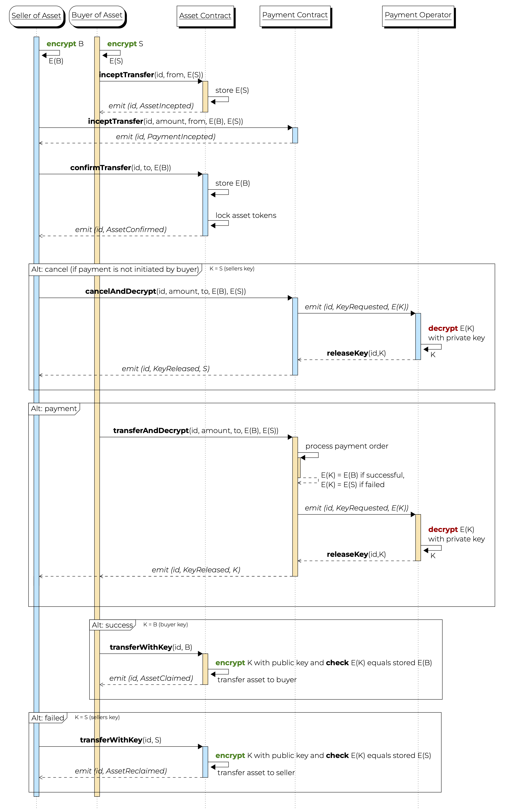

## Abstract

The interfaces model the functional transaction scheme to establish a secure delivery-versus-payment across two blockchains, where a) no intermediary is required and b) the operator of the payment chain/payment system has a small overhead and does not need to store state.
The main idea comes with two requirements: First, the payment chain operator hosts a stateless decryption service that allows decrypting messages with his secret key. Second, a "Payment Contract" is deployed on the payment chain that implements a function
```solidity
function transferAndDecrypt(uint id, address from, address to, keyEncryptedSuccess, string keyEncryptedFailure) external;
```
that processes the (trigger-based) payment and emits the decrypted key depending on the success or failure of the transaction. The respective key can then trigger an associated transaction, e.g. claiming delivery by the buyer or re-claiming the locked asset by the seller.

## Motivation

Within the domain of financial transactions and distributed ledger technology (DLT), the Hash-Linked Contract (HLC) concept has been recognized as valuable and has been thoroughly investigated.
The concept may help to solve the challenge of delivery-versus-payment (DvP), especially in cases where the asset chain and payment system (which may be a chain, too) are separated. The proposed solutions are based on an API-based interaction mechanism which bridges the communication between a so-called Asset Chain and a corresponding Payment System or require complex and problematic time-locks (\cite{BancaItalia}). We believe that an even more lightweight interaction across both systems is possible, especially when the payment system is also based on a DLT infrastructure.

## Specificaiton

### Methods

#### Smart Contract on the Asset Chain

```solidity
interface IDvPAsset {
    event AssetTransferIncepted(address initiator, uint id);
    event AssetTransferConfirmed(address confirmer, uint id);
    event AssetClaimed(uint id, string key);
    event AssetReclaimed(uint id, string key);

    function inceptTransfer(uint id, int amount, address from, string keyEncryptedSeller) external;
    function confirmTransfer(uint id, int amount, address to, string keyEncryptedBuyer) external;
    function transferWithKey(uint id, string key) external;
}
```
#### Smart Contract on the Payment Chain

```solidity
interface IDvPPayment {
    event PaymentTransferIncepted(address initiator, uint id, int amount);
    event TransferKeyRequested(uint id, string encryptedKey);
    event TransferKeyReleased(uint id, bool success, string key);

    function inceptTransfer(uint id, int amount, address from, string keyEncryptedSuccess, string keyEncryptedFailure) external;
    function transferAndDecrypt(uint id, address from, address to, keyEncryptedSuccess, string keyEncryptedFailure) external;
    function cancelAndDecrypt(uint id, address from, address to, keyEncryptedSuccess, string keyEncryptedFailure) external;
}
```

## Rationale

The rationale is described in the following sequence diagram.

### Sequence diagram of delivery versus payment



## Reference Implementation

A reference implementation is currently not provided. It may be added in a later phase.

## Test Cases

As there is no reference implementation, there are no test cases.

## Security Considerations

No known security issues up to now.

## Copyright

Copyright and related rights waived via [CC0](../LICENSE.md).

